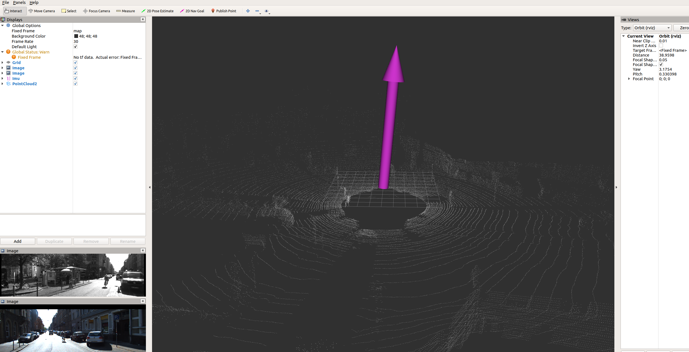

仓库介绍：
该代码仓库是以melodic版本的ros作为开发框架，以python2.7为开发语言，用于自己开发验证一些简单的自动驾驶算法。

预期功能：标准数据集适配，SLAM，目标检测，目标跟踪，路径规划

开发进度：
2022.01.03 可视化kitti数据集中的raw data 参考https://www.bilibili.com/video/BV1qV41167d2

数据集相关：
kitti数据集raw data部分：http://www.cvlibs.net/datasets/kitti/raw_data.php

注意事项：
- 1.推荐在ubuntu18.04系统上运行，建议melodic ros系统，建议使用pycharm或clion作为开发IDE
- 2.如果使用pycharm调试运行时出现找不到cv_bridge.so，请在Run/Debug Configurations的environment variables中添加LD_LIBRARY_PATH=$LD_LIBRARY_PATH:/opt/ros/melodic/lib
- 3.如果使用pycharm调试运行时出现找不到tf2_ros，请参考https://blog.csdn.net/weixin_44445507/article/details/118335039
- 4.其他在pycharm中开发ROS产生的问题请自行google or baidu，有时候pycharm中调试出问题，但使用roslaunch就没事儿。